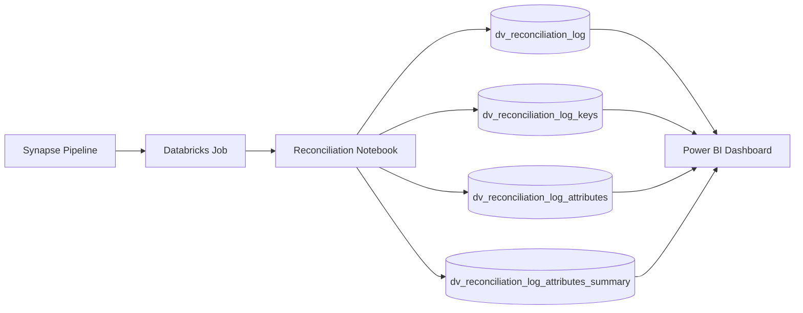

```mermaid
flowchart LR
    A[Synapse Pipeline] --> B[Databricks Job]
    B --> C[Reconciliation Notebook]
    C --> D[(dv_reconciliation_log)]
    C --> E[(dv_reconciliation_log_keys)]
    C --> F[(dv_reconciliation_log_attributes)]
    C --> G[(dv_reconciliation_log_attributes_summary)]
    D & E & F & G --> H[Power BI Dashboard]
```
