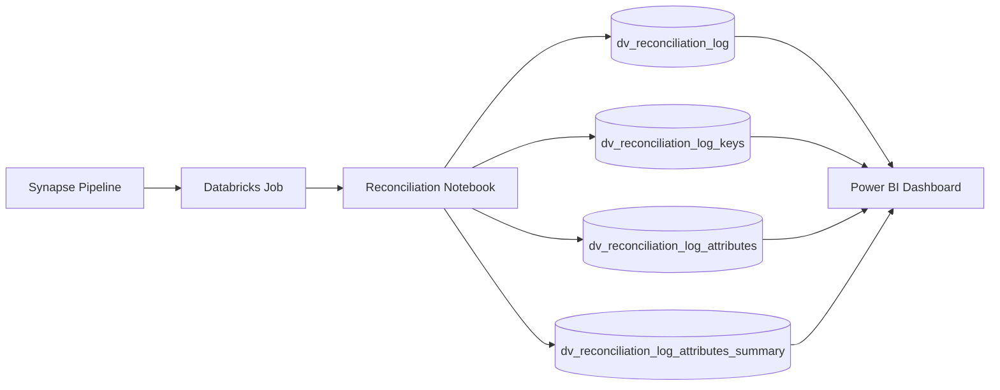
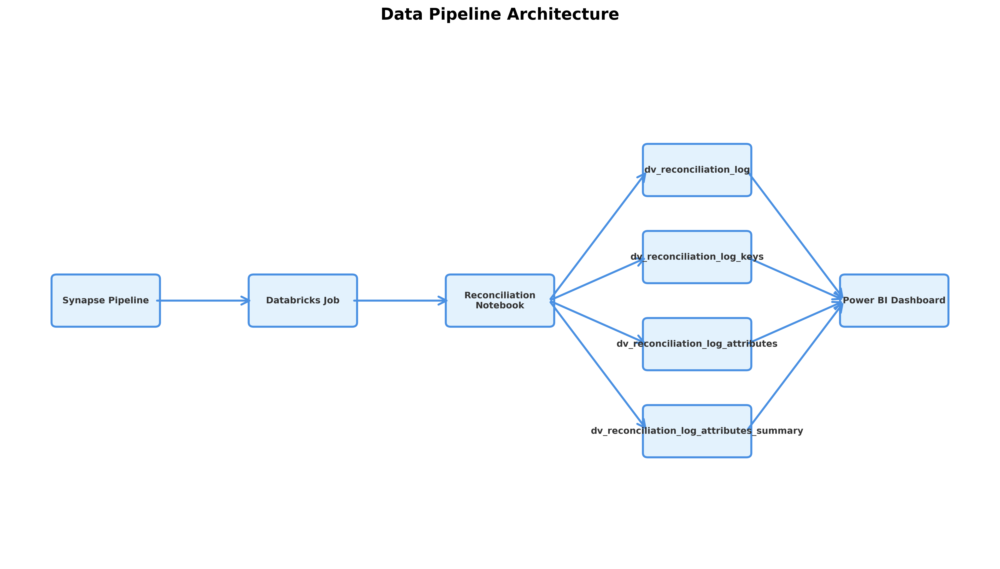

# Data Pipeline Architecture

## GitHub View (Mermaid Diagram)


## Databricks View (Image)
For Databricks notebooks, use the following image:



### Using in Databricks Notebooks
To use this diagram in Databricks markdown cells, you have two options:

**Option 1: Upload to DBFS**
1. Upload `pipeline_diagram.png` to DBFS (e.g., `/FileStore/images/pipeline_diagram.png`)
2. Reference it in your markdown cell:
   ```
   
   ```

**Option 2: Use from Repository**
1. If your notebook is synced with this GitHub repository
2. Reference the image directly:
   ```
   
   ```
